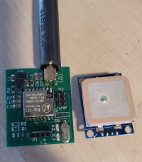

# MicroBeacon_2021
 LorAPRS tracker with GPS
 
- Compatible with ASCII packet format [LoRa-APRS-tracker](https://github.com/lora-aprs/LoRa_APRS_Tracker) and binary/AX25 format [sh123/esp32_loraprs](https://github.com/sh123/esp32_loraprs) select in project.h
- Use Mic-E SSID digipeating(25 bytes) or standard path (32 bytes) or no path.
- Use UBlox GPS at 9600bps.
- Beacon interval is fixed, but in next version use Smartbeaconing.
- Send status packet too at fixed interval. (voltage or Sat status with comment)

Configure tracker with project.h file. 

[See schematic and PCB](Board.pdf)

  
 
I use also [DigiPro](https://github.com/ve2yag/MicroBeacon_2021) as digipeater(same PCB) and Lorakiss as Kiss-over-IP Lora modem, hooked to APRX on a raspberry pi to create a dual-port igate with Direwolf.

